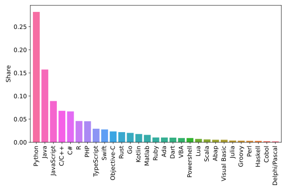

## Motivation

### Why should I learn programming as a chemist?

In the 21st century, programming is a skill that is becoming increasingly 
important. This is not only true for computer scientists, but also for
chemists, physicists, biologists, and many other scientists. The knowledge
of programming languages can help you to solve a wide range of problems more 
efficiently and automate repetitive tasks. In addition, programming languages
can be used to visualise and analyse data, which is an important part of
scientific work.

### Why Python?

Python is one of the most widely used programming languages and is particularly
beginner-friendly. The following figure shows the popularity of some programming
languages according to the <i>**P**opularit**Y** of **P**rogramming **L**anguage</i>
([PYPL](https://pypl.github.io/PYPL.html)) Indexes (as of Jan. 2024). 


*Popularity of programming languages. Taken from the 
[PYPL Index](https://pypl.github.io/PYPL.html).*

One reason for that is that Python often requires significantly less code than compiled languages
like Java or C/C++ to implement the same algorithms.


*Program length, measured in the number of non-commented lines of code (LOC).*

Moreover, it is often possible to accomplish the same task with a scripting language,
such as Python, in significantly less time than with a compiled language.


*Development time to accomplish a certain programming task, measured in hours.*

On the other hand, some people argue that Python is a slow language. This is true
to some extent. However, let us consider the following points:

#### Python is (also) an interpreted language

Python itself is a C program that first compiles the source code into so-called
[*bytecode*](https://en.wikipedia.org/wiki/Bytecode) and then interprets and executes
it. This is in contrast to compiled languages like C, C++, Rust, etc., where the source
code is compiled into machine code. The compiler can perform many optimizations on the
code, which leads to a shorter runtime. 

~~~admonish example collapsible=true
This behaviour can be shown with a simple example:
A naive implementation that sums all odd numbers up to 100 million.
This could look like this:

```python
s = 0
for i in range(100_000_000):
    if i % 2 == 1:
        s += i
```

This code takes about 8 seconds on the author's computer.
Now, the same algorithm is implemented in a compiled language (in this case *Rust*)
to show the influence of the compiler.

```rust,no_run,no_playground
let mut s: usize = 0;
for i in 0..100_000_000 {
    if i % 2 == 1 {
        s += i;
    }
}
```

This code actually has no runtime at all and is evaluated immediately.
The compiler is smart enough to understand that everything can be calculated at
compile time and simply replaces the value for the variable `s`. This now makes
clear that compiled languages can benefit from methods that interpreted languages
simply do not have due to their approach. However, we have already seen that
compiled languages usually require more lines of code and more work. Moreover,
there are usually many more concepts to learn in compiled languages.
~~~

#### Python can be very performant

During this course, we will often use Python libraries like NumPy or SciPy for mathematical
algorithms, especially linear algebra. These packages bring two major advantages.
On the one hand, they allow the very easy use of complicated algorithms and, on the other
hand, these packages are written in compiled languages like C or Fortran. This way, we can
benefit from the performance advantages without having to learn a potentially more complicated
language.

