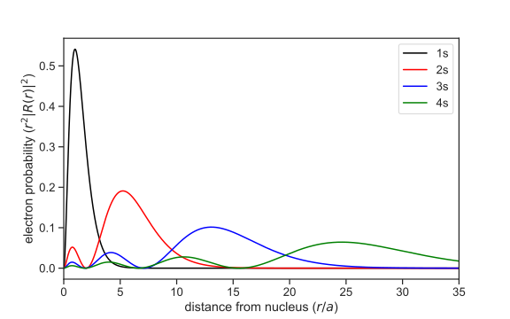
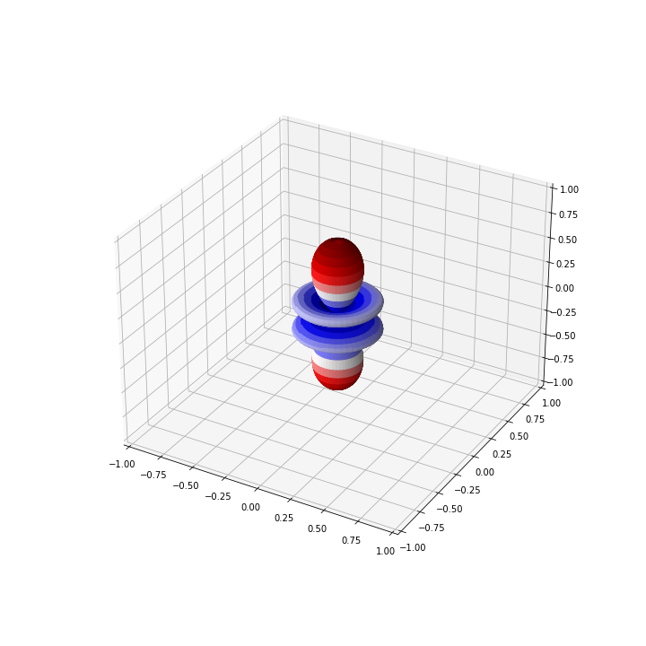

## Application: Hydrogen Atom

We learned in the bachelor quantum mechanics class that the
wavefunction of the hydrogen atom has the following form: 
$$
\psi_{nlm}(\mathbf{r})=\psi(r, \theta, \phi)=R_{n l}(r) Y_{l m}(\theta, \phi)
$$
where \\(R_{n l}(r) \\) is the radial function and \\(Y_{l m}\\) are the 
spherical harmonics. The radial functions are given by
$$
R_{n l}(r)=\sqrt{\left(\frac{2}{n a}\right)^{3} \frac{(n-l-1) !}{2 n[(n+l) !]}} e^{-r / n a}\left(\frac{2 r}{n a}\right)^{l}\left[L_{n-l-1}^{2 l+1}(2 r / n a)\right]
$$
Here \\(n, l\\) are the principal and azimuthal quantum number. 
The Bohr radius is denoted by \\( a\\) and \\( L_{n-l-1}^{2l+1} \\) is
the associated/generalized Laguerre polynomial of degree \\( n - l
-1\\). We will work with atomic units in the following, so that \\( a  =
1\\).
With this we start by defining the radial function:
```python
{{#include ../codes/02-symbolic_computation/hydrogen.py:radial}} 
```
We can check if we have any typo in this function by simply calling it 
with the three symbols
```python
{{#include ../codes/02-symbolic_computation/hydrogen.py:check_radial}} 
```
In the next step we can define the wave function by building the
product of the radial function and the spherical harmonics.

```python
{{#include ../codes/02-symbolic_computation/hydrogen.py:wavefunction}} 
```
With this in hand,  we have everything we need and we can start playing 
with wave functions of the Hydrogen atom. Let us begin with the simplest
one, the 1s function \\( \psi_{100} \\). 
```python
{{#include ../codes/02-symbolic_computation/hydrogen.py:1s_function}} 
```
We can now use what we learned in the previous chapter and evaluate for
example the wavefunction in the limit of \\(\infty\\)
$$
\lim_{r\to \infty} \psi_{100}(r, \theta, \phi)
$$
```python
{{#include ../codes/02-symbolic_computation/hydrogen.py:1s_limit_infty}} 
```
This evaluates to zero, as we would expect. Now let's check if our
normalization of the wave function is correct. For this we expect, that 
the following holds:
$$
\int_{0}^{+\infty} \mathrm{d}r \int_{0}^{\pi} \mathrm{d}\theta \int_{0}^{2\pi} \mathrm{d}\phi \  r^2 \sin(\theta)\ \left| \psi_{100}(r,\theta,\phi) \right|^2 = 1
$$
We can easily check this, since we already learned how to calculate 
definite integrals.
```python
{{#include ../codes/02-symbolic_computation/hydrogen.py:1s_is_normalized}} 
```

### Visualizing the wave functions of the H atom. 

To visualize the wave functions we need to evaluate them on a 
finite grid. 

#### Radial part of wave function. 

For this example we will examine the radial part of the first 4 
s-functions. We start by defining them:
```python
{{#include ../codes/02-symbolic_computation/hydrogen.py:radial_parts}}
```
This gives us 4 functions that will return numeric values of the
radial part at some radius \\(r\\). 
The radial electron probability is given by \\(r^2 |R(r)|^2\\). We will use
these functions to evaluate the wave functions on a grid and plot
the values with Matplotlib.
```python
{{#include ../codes/02-symbolic_computation/hydrogen.py:plot_radial}}
```


#### Spherical Harmonics

In the next step, we want to graph the spherical harmonics. To do
this, we first import all the necessary modules and then define first the
symbolic spherical harmoncis, `Ylm_sym`, and then the numerical function `Ylm`.  
```python
{{#include ../codes/02-symbolic_computation/hydrogen.py:define_Ylm}}
``` 
The variable `Ylm` now contains a Python function with 4 arguments (`l`, `m`,
`theta`, `phi`) and returns the numeric value (complex number, type: `complex`)
of the spherical harmonics. Since we want to represent the values of the
spherical harmonics as the distance from the origin, which is a positive real
number, we should use the absolute value of the spherical harmonics. The real
spherical harmonics $\widetilde{Y}_{l,m}$ can be obtained by
$$
  \widetilde{Y}_{l,m} = \begin{cases}
    \iu \frac{1}{\sqrt{2}} \left( Y_{l,-m} - (-1)^m Y_{l,m} \right) & m > 0 \\
    Y_{l,0} & m = 0 \\
    \frac{1}{\sqrt{2}} \left( Y_{l,-m} + (-1)^m Y_{l,m} \right) & m < 0
  \end{cases}\,.
$$
This can be implemented as follows:
```python
{{#include ../codes/02-symbolic_computation/hydrogen.py:define_real_Ylm}}
```

To be able to display the function graphically,
however, we have to evaluate the function not only at one point, but on a
two-dimensional grid (\\(\theta, \phi\\)) and then display the values on this
grid. Therefore, we define the grid for \\(\theta\\) and \\(\phi\\) and evaluate
the \\(Y_{lm} \\) for each point on this grid. 
```python
{{#include ../codes/02-symbolic_computation/hydrogen.py:calculate_Ylm}}
```
Now, however, we still have a small problem because we want to represent
our data points in a Cartesian coordinate system, but our grid points are
defined in spherical coordinates. Therefore it is necessary to transform the
calculated values of Ylm into the Cartesian coordinate system. The
transformation reads:
```python
{{#include ../codes/02-symbolic_computation/hydrogen.py:convert_to_cartesian}}
```
We took the absolute value of the real spherical harmonics to make sure that
we have a positive real number. 
Now we have everything we need to represent the spherical harmonics in 3
dimensions. We do a little trick and map the data points to a number range from
0 to 1 and store these values in the variable `colors`. This allows us to
color the spherical harmonics with a [colormap](https://matplotlib.org/3.5.0/tutorials/colors/colormaps.html)
from Matplotlib. 
```python 
{{#include ../codes/02-symbolic_computation/hydrogen.py:plot_spherical_harmonics}} 
```
For the above example with \\( Y_{30}\\), the graph should look like 

