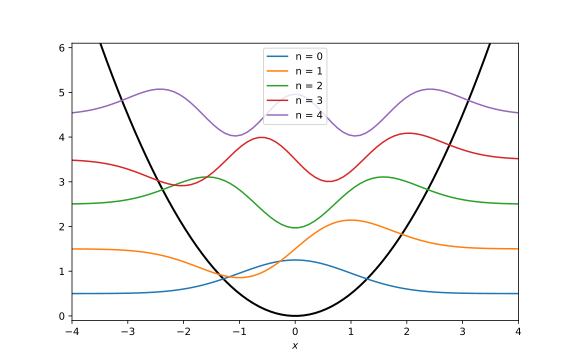

## Application: Harmonic Oscillator

The quantum harmonic oscillator is described by the wavefunctions
$$ \psi_{n}(x) = \frac{1}{\sqrt{2^n n!}} \left( \frac{m \omega}{\pi \hbar} \right)^{1/4} \exp\left(-\frac{m\omega x^2}{2\hbar}\right) H_{n}\left( \sqrt{\frac{m\omega}{\hbar}} x \right) $$

where the functions \\(H_{n}(z)\\) are the physicists' Hermite polynomials:
$$ H_{n}(z) = (-1)^n\  \mathrm{e}^{z^2} \frac{\mathrm{d}^n}{\mathrm{d}z^n} \left( \mathrm{e}^{-z^2} \right) $$

The corresponding energy levels are
$$ E_{n} = \hbar \omega \left( n + \frac{1}{2} \right) $$

We now want to use SymPy to compute eigenenergies and eigenfunctions. 
We start by importing `sympy` and necessary variables:
```python
{{#include ../codes/02-symbolic_computation/harmonic_oscillator.py:import}}
```

The eigenenergies are straightforward to compute. One can just use the 
definition directly and substitute \\(n\\) with an integer, e.g. 5:
```python
{{#include ../codes/02-symbolic_computation/harmonic_oscillator.py:energy}}
```
This outputs \\(\frac{11}{2}\\). Note that atomic units are used for 
simplicity. 

In order to evaluate the wave function, we have to at first compute the 
Hermite polynomial. There are multiple ways to do it. The first is to use 
its definition directly and compute higher order derivatives of the 
exponential function:
```python
{{#include ../codes/02-symbolic_computation/harmonic_oscillator.py:hermite_definition}}
```

Alternatively, we could use recurrence relation for Hermite polynomials. 
This will be left as an exercise for the course attendees.

For `n = 5`, we obtain the polynomial 
$$ H\_5(x) = 32 x^5 - 160 x^3 + 120 x$$

We can then use this to evaluate the wave function:
```python
{{#include ../codes/02-symbolic_computation/harmonic_oscillator.py:wave_function}}
```

For a system with, say, \\(m = 1\\) and \\(\omega = 1\\), we can construct 
its wave function by 
```python
{{#include ../codes/02-symbolic_computation/harmonic_oscillator.py:wave_function_param}}
```
Further substituting `x` with any numerical value would evaluate the 
wave function at that point.  

We can again convert the sympy expression to a numpy function 
and plot some wavefunctions.
```python
{{#include ../codes/02-symbolic_computation/harmonic_oscillator.py:wave_function_param_plot}}
```
This code block produces


Sometimes one might just want to use SymPy to generate symbolic expressions 
to be used in functions. Instead of typing the results in by hand, one could 
use one of SymPy's built-in printers. Here, we shall use `NumPyPrinter`, 
which converts a SymPy expression to a string of python code:
```python
{{#include ../codes/02-symbolic_computation/harmonic_oscillator.py:numpy_printer}}
```
This output can be copied and used to evaluate \\(\psi_{5}(x)\\). 
Since we often import NumPy with the alias `np`, `numpy` from the original 
string is replaced.
