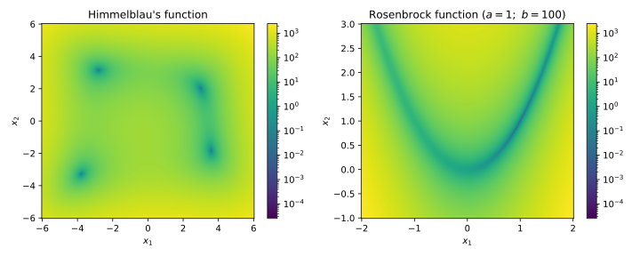

## Test Functions

Before diving into specific optimization algorithms, we will first take a 
look at some test functions that can help us check how well our algorithms 
are performing. There are lots of 
[Test functions for optimization](https://en.wikipedia.org/wiki/Test_functions_for_optimization)
out there, serving different purposes. Because we want to visualize the test 
functions, we will only consider functions on \\(\mathbb{R}^2\\).

### Base Class
Before starting with any concrete functions, we will first define an 
abstract class `ObjectiveFunction` which will be the base class for all test 
functions.
```python
{{#include ../codes/04-numerical_optimisation/objective_function.py:imports}}
```
```python
{{#include ../codes/04-numerical_optimisation/objective_function.py:base_class}}
```
This abstract class defines the `__call__` method, which will be executed 
when we call an instance of a class derived from `ObjectiveFunction`. Because 
the function value and gradient depend on the specific function, they are 
decorated with the `@abstractmethod` decorator. This means that any class 
derived from `ObjectiveFunction` must implement these two methods.

We may also want to plot the function and possibly the optimization path. 
We can define two functions for this purpose.
```python
{{#include ../codes/04-numerical_optimisation/objective_function.py:plot_2d_objective_function}}
```
```python
{{#include ../codes/04-numerical_optimisation/objective_function.py:plot_2d_optimisation}}
```

### Himmelblau's Function
Himmelblau's function is a rational function defined by
$$
  f(x) = (x_1^2 + x_2 - 11)^2 + (x_1 + x_2^2 - 7)^2
$$

It has 4 local minima, all with the same function value 
\\(f(x^{\*}) = 0\\). 
```python
{{#include ../codes/04-numerical_optimisation/objective_function.py:himmelblau_function}}
```

### Rosenbrock's Function
Rosenbrock's function is a non-convex function defined by
$$
  f(x) = (a - x_1)^2 + b(x_2 - x_1^2)^2
$$
where \\(a\\) and \\(b\\) are parameters. The function has a global minimum 
at \\(x = (a, a^2)\\) with \\(f(x^{\*}) = 0\\). This global 
minimum lies in a long, narrow, and relatively flat valley, which makes it 
difficult to find.
```python
{{#include ../codes/04-numerical_optimisation/objective_function.py:rosenbrock_function}}
```

We can use our routine `plot_2d_objective_function` to plot 
these two functions:
```python
{{#include ../codes/04-numerical_optimisation/plot_objective_functions.py:code}}
```


